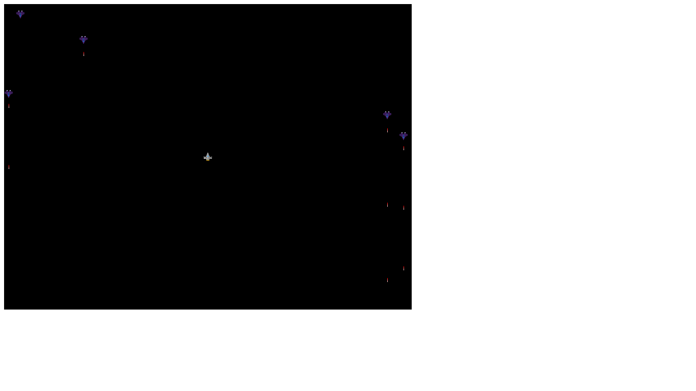

# Project: SHOOTER GAME

> Shooter wars is a Top-Down Space [Shooter Game](https://en.m.wikipedia.org/wiki/Shooter_game), where the player's space ship aims to destroy enemies' spacecraft thereby accumulating point while avoiding being hit by the enemy.



## How To Play

> Here's how to play Shooter wars

- Use the ```Left```, ```Right```, ```Up```, and ```Down``` arrow ```keys``` to navigate around the screen and dodge enemies' lasers
- Use the ```SPACE KEY``` to shoot lasers
- Any laser aim at the enemy's spacecraft destroys the target and scores you a point
- Happy playing!


## Live demo

🔗 [Play shooter wars](https://stoic-lichterman-bb2b21.netlify.app/)

## Built With

- Javascript (ES6)
- Phaser 3
- HTML / CSS
- Webpack
- Babel
- Jest


## Run shooter wars

To get a local copy up and running follow these simple steps.

### Prerequisites

For ```Shooter-game``` to work locally on your machine, you need these installations:
- Nodejs and npm
- A Web Browser that has ```<canvas></canvas>``` support

### Install

1) Open the Terminal
2) Run

```sh
git clone https://github.com/RICKCOYL/shooter-game.git
```

or, for SSH:

```sh
git clone git@github.com:RICKCOYL/shooter-game.git
```

3) Run ```cd shooter-game``` to enter the main directory
4) Run ```npm install```
5) Run ```npm run start```
6) Run the index.html on live sever to play the game
7) Happy playing!

## Testing

1) Open the Terminal
2) Run ```cd shooter-gamer``` to enter the main directory
3) Run ```npm test```

## Author

👤 **RICK OBURU**

- Github: [@RICKCOYL](https://github.com/RICKCOYL)
- Twitter: [@rickcoyl](https://twitter.com/rickcoyl)
- Linkedin: [Rick Oburu](https://www.linkedin.com/in/rick-oburu/)


## 🤝 Contributing

Contributions, issues, and feature requests are welcome!

Feel free to check the [issues page](https://github.com/RICKCOYL/shooter-game/issues).

## Show your support

Give a ⭐️ if you like this project!

## Acknowledgments

- Microverse for showing the way for this project to happen
- Credit wubitog and Skorpio ( http://opengameart.org/users/skorpio )
- [CraftPix.net](https://opengameart.org/users/craftpixnet-2d-game-assets) 2D Game Assets
- [Create a videogame template](https://phasertutorials.com/creating-a-phaser-3-template-part-1/)
- [The space shooter game tutorial](https://learn.yorkcs.com/category/tutorials/gamedev/phaser-3/build-a-space-shooter-with-phaser-3/)